# ComfyUI Community Edition

> **Disclaimer:** This service is provided by a third party. We try our best to ensure its safety, accuracy and reliability, but we cannot guarantee that it is completely free from failures, interruptions, errors or attacks. Therefore, the company hereby declares that it makes no representations, warranties or commitments regarding the content, accuracy, completeness, reliability, suitability and timeliness of the Service and is not liable for any direct or indirect loss or damage arising from your use of the Service; for third-party websites, applications, products and services that you access through the Service, do not assume any responsibility for its content, accuracy, completeness, reliability, applicability and timeliness, and you shall bear the risks and responsibilities of the consequences of use; for any loss or damage arising from your use of this service, including but not limited to direct loss, indirect loss, loss of profits, loss of goodwill, loss of data or other economic losses, even if we have been advised in advance of the possibility of such loss or damage; we reserve the right to amend this statement from time to time, so please check this statement regularly before using the Service. If you have any questions or concerns about this Statement or the Service, please contact us.

## Overview
ComfyUI is the most powerful open source, node-based, generative AI application for creating images, video, and audio content. Relying on cutting-edge open source models can achieve video and image generation.
According to the official documentation, the ComfyUI has the following characteristics:
Node/Graph/Flowchart interface for experimenting and creating complex stable diffusion workflows without writing any code.
Full support for SD1.x, SD2.x and SDXL
asynchronous queue system
Multiple optimizations re-execute only those parts of the workflow that have changed between executions.
Command line options: -- lowvram to make it run on GPUs with less than 3GB of memory (automatically enabled on GPUs with low memory)
Can be used even without GPU: -- cpu (slow)
Can load ckpt, safetensors, and diffusers models/checkpoints. Independent VAE and CLIP models.
Embedding/Text Inversion
Loras (regular, locon and loha)
Hypernetwork
Load the complete workflow from the generated PNG file (with seed
Save/load workflow as Json file.
The node interface can be used to create complex workflows, such as "Hires fix" or more advanced workflows.
Regional Synthesis
Inline using regular and Inline models.
Control network and T2I adapter
Upgrade models (ESRGAN, ESRGAN variants, SwinIR, Swin2SR, etc.)
unCLIP model
GLIGEN
Model Merge
Latent preview with TAESD
Start up extremely fast.
Works completely offline: nothing is downloaded.
The configuration file sets the search path for the model.

## Prerequisites

To deploy the ComfyUI Community Edition service instance, you need to access and create some Alibaba Cloud resources. Therefore, your account must contain permissions for the following resources. **Note**: This permission is required only when your account is a RAM account.

| Permission policy name | Comment |
| ------------------------------------- | ------------------------ |
| AliyunECSFullAccess | Permissions for managing ECS instances |
| AliyunVPCFullAccess | Permissions to manage a VPC |
| AliyunROSFullAccess | Manage permissions for Resource Orchestration Service (ROS) |
| AliyunCSFullAccess | Manage permissions for Container Service (CS) |
| AliyunComputeNestUserFullAccess | Manage user-side permissions for the compute nest service (ComputeNest) |
| AliyunOSSFullAccess | Permissions to manage Network Object Storage Service (OSS) |

## Billing Description

### ACS version fee
The cost of this service on Alibaba Cloud is mainly related:
* ACS Fees
* Springboard machine ECS fee
* Note: This ECS is used to deploy and manage K8S clusters. The/root directory stores the K8S Yaml resource files used for deployment. If you need to modify the parameters later, you can re-execute the apply kubectl after modifying them.
If the deployment is completed, it can be released by itself if it is not needed.
* OSS Fees

Billing method: pay by volume (hour) or package year and month
The estimated cost can be seen in real time when the instance is created.

### Community Edition Fee
The cost of community edition deployment in computing nest mainly involves:
Selected vCPU and Memory Specifications
System disk type and capacity
public network bandwidth

## Overall architecture

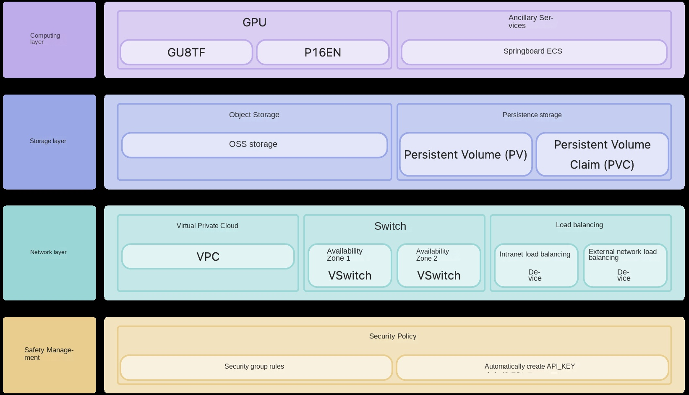

## Deployment process

### ACS version deployment

1. Click [Deployment Link](https://computenest.console.aliyun.com/service/instance/create/cn-hangzhou?type=user&ServiceName=ComfyUI-ACS社区版). Fill in the parameters according to the interface prompt to see the corresponding RFQ details. After confirming the parameters, click **Next: Confirm Order**.
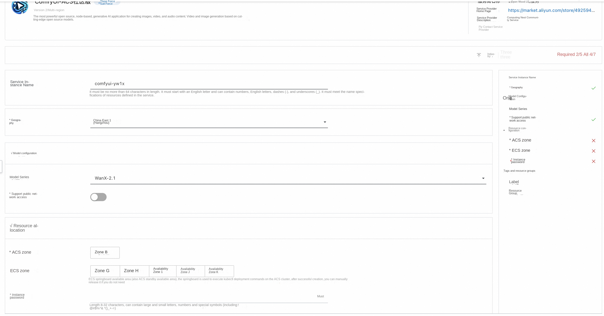

2. Click **Next: After confirming the order**, you can also see the price preview, then click **Deploy Now** and wait for the deployment to complete.
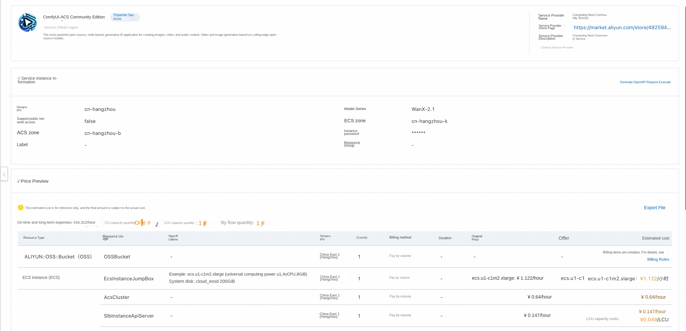

3. Wait for the deployment to complete before you can start using the service.
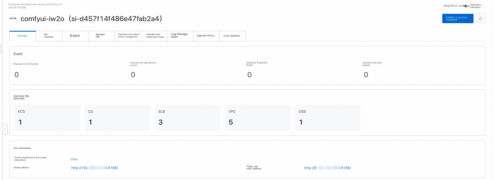

### ECS Community Edition Deployment

1. Visit the calculation nest [deployment link](https://computenest.console.aliyun.com/service/instance/create/cn-hangzhou?type=user&ServiceName=Comfy-UI社区版) and fill in the deployment parameters as prompted
2. Fill in the instance parameters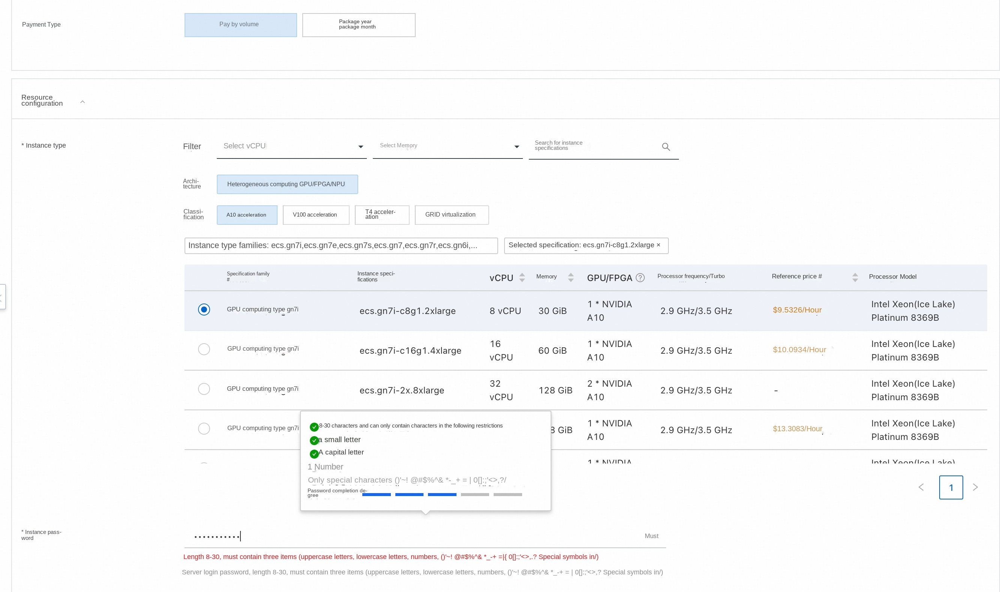, select the method and instance type you want to purchase.
3. * * Note * * If you want to use the video function, in order to reduce the possibility of RAM memory explosion, please select a graphics card specification above A10 with a memory specification of more than 60G.
4. Choose to create a new private network or directly use an existing private network according to your needs. Fill in the available area and network parameters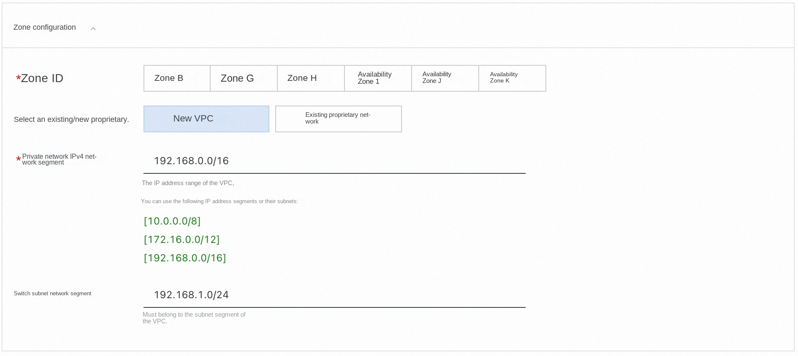
5. Click Create Now and wait for the service instance deployment to complete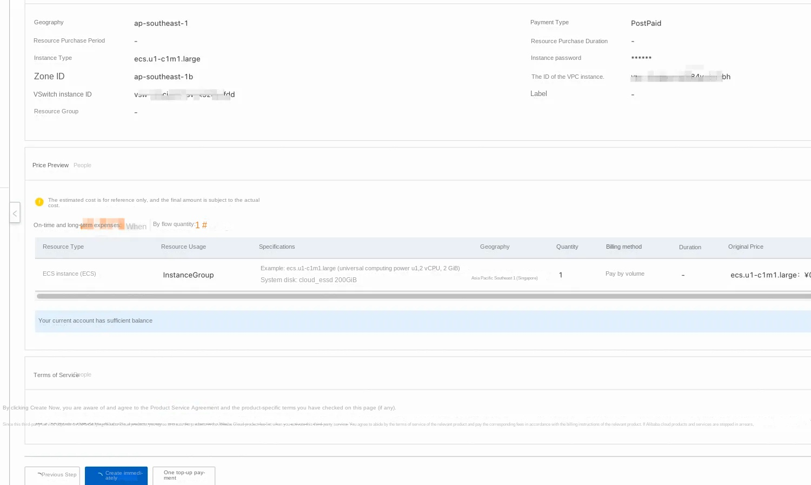
6. After the service instance is deployed, click the instance ID to enter the details interface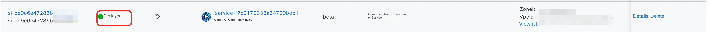
7. Access the URL of the service instance, where we use a secure proxy for direct access. Avoid exposing your data to the public network to be obtained by others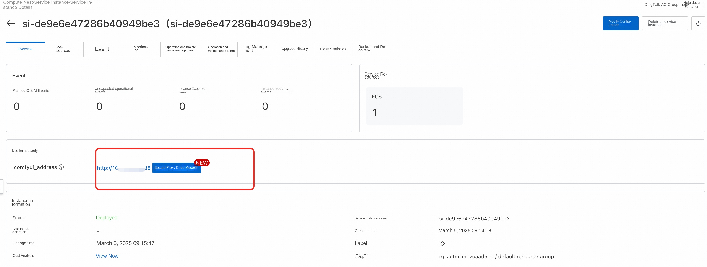
8. Enter the ComfyUI use interface

## Parameter description

| Parameter group | Parameter item | Description |
| ---------- | -------------- | ------------------------------------------------------------------ |
| Service Instance | Service Instance Name | The service instance name must be no more than 64 characters in length and must start with an English letter. It can contain numbers, English letters, dashes (-), and underscores (_). |
| | Region | The region where the service instance is deployed |
| | Billing Type | Billing type of the resource: Pay-As-You-Go and Subscription |
| ECS instance configuration | Instance type | Available instance types in the zone |
| Network Configuration | Availability Zone | The zone where the ECS instance is located |
| | VPC ID | The VPC where the resource resides |
| | VSwitch ID | VSwitch where the resource resides |

## Built-in model description

### Overview of main models

| Model name | Type | Parameter scale | Resolution | Quantization format | Introduction |
| --------- | ------ | --------- | --------- | --------- | ------ | ------ |
| Wan2_1-I2V-14B-480P_fp8_e4m3fn.safetensors | Picture Video | 14B | 480P | FP8 E4M3FN | WanVideo 2.1 Picture Video Model, 14B Parameters, Support 480P Resolution Output, Use FP8 Quantization to Save Video |
| Wan2_1-T2V-14B_fp8_e4m3fn.safetensors | Vincent Video | 14B | Standard | FP8 E4M3FN | WanVideo 2.1 Vincent Video Model, 14B Parameters, Generate Video Directly from Text, FP8 Quantized Version |
| flux1-dev.safetensors | Image Generation | - | High Resolution | Standard | Flux. 1 Dev model, high-quality image generation model, support for high-resolution output, developer version |
| wan2.1/Wan2_1-T2V-1_3B_fp8_e4m3fn.safetensors | Wensheng Video | 1.3B | Standard | FP8 E4M3FN | WanVideo 2.1 Lightweight Wensheng Video Model, 1.3B Parameters, Lower Display and Storage Requirements Compared with 14B Version, Suitable for Resource-Constrained Environment |
| vace-1.3b.safetensors | Video Editing | 1.3B | Standard | Standard | VACE 1.3B video editing model, focusing on video content editing and processing, lightweight design, suitable for fast video editing tasks |

### Full Model Resource List

####📊**Model Categories Overview**

| **Category** | **Directory** | **Total Size** | **Model Count** | **Primary Function** |
| -------------- | --------------- | ---------------- | ----------------- | ----------------- |
| Diffusion Models | '/diffusion_models' | 53GB | 6 models | Core image/video generation |
| Text Encoders | '/text_encoders' | 22GB | 2 models | Text understanding |
| CLIP Models | '/clip' | 17GB | 4 models | Vision-language understanding |
| Checkpoints | '/checkpoints' | 17GB | 1 model | Complete model checkpoints |
| UNET Models | '/unet' | 14GB | 1 model | Neural network architecture |
| VAE Models | '/vae' | 1.5GB | 5 models | Latent space processing |
| CLIP Vision | '/clip_vision' | 2.4GB | 1 model | Visual understanding |
| Face Restoration | '/facerestore_models' | 1.3GB | 4 models | Face enhancement |
| Video Interpolation | '/interpolation' | 824MB | 4 models | Frame interpolation |
| Content Safety | '/nsfw_detector' | 329MB | 1 model | Content moderation |
| Upscaling | '/upscale_models' | 192MB | 3 models | Image super-resolution |
| VAE Approximation | '/vae_approx' | 19MB | 4 models | Fast preview generation |
| Text Embeddings | '/embeddings' | 260KB | 2 models | Negative prompts |
| Configurations | '/configs' | 52KB | 11 files | Model configurations |

####🎯**Diffusion Models** ('/diffusion_models') - 53GB

| **Model Name** | **Size** | **Type** | **Parameters** | **Function** | **Best For** |
| ---------------- | ---------- | ---------- | ---------------- | -------------- | -------------- |
| 'Wan2_1-I2V-14B-480P_fp8_e4m3fn.safetensors' | 16GB | Image→Video | 14B | Animate static images | Image animation |
| 'Wan2_1-T2V-14B_fp8_e4m3fn.safetensors' | 14GB | Text→Video | 14B | Generate videos from text | Text-to-video |
| 'flux1-dev.safetensors' | 12GB | Text→Image | - | Experimental image generation | Testing new features |
| 'wan21_vace_1_3b.safetensors' | 6.7GB | Video Editing | 1.3B | Enhanced video editing | Professional editing |
| 'wan2.1/Wan2_1-T2V-1_3B_fp8_e4m3fn.safetensors' | 1.4GB | Text→Video | 1.3B | Fast video generation | Quick previews |

####🧠**Text Encoders** ('/text_encoders') - 22GB

| **Model Name** | **Size** | **Format** | **Precision** | **Function** | **Best For** |
| ---------------- | ---------- | ------------ | --------------- | -------------- | -------------- |
| 'wan2.1/umt5-xxl-enc-bf16.safetensors' | 11GB | SafeTensors | BF16 | Multi-language text encoding | High-quality generation |
| 'wan2.1/models_t5_umt5-xxl-enc-bf16.pth' | 11GB | PyTorch | BF16 | T5-based text encoding | PyTorch workflows |

####🎨**CLIP Models** ('/clip') - 17GB

| **Model Name** | **Size** | **Type** | **Precision** | **Function** | **Best For** |
| ---------------- | ---------- | ---------- | ------------------- | -------------- | -------------- |
| 't5xxl_fp16.safetensors' | 9.2GB | T5 Text Encoder | FP16 | Advanced text understanding | Complex prompts |
| 'umt5_xxl_fp8_e4m3fn.safetensors' | 6.3GB | UMT5 Encoder | FP8 | Efficient text encoding | Resource optimization |
| 'wan2.1/open-clip-xlm-roberta-large-vit-huge-14_visual_fp16.safetensors' | 1.2GB | Multilingual CLIP | FP16 | Cross-language vision | International content |
| 'clip_l.safetensors' | 235MB | CLIP Language | - | Vision-language alignment | Standard workflows |

####💾**Checkpoints** ('/checkpoints') - 17GB

| **Model Name** | **Size** | **Type** | **Precision** | **Function** | **Best For** |
| ---------------- | ---------- | ---------- | ------------------- | -------------- | -------------- |
| 'flux1-schnell-fp8.safetensors' | 17GB | Fast Image Gen | FP8 | Rapid image generation | Production workflows |

####🔧**UNET Models** ('/unet') - 14GB

| **Model Name** | **Size** | **Type** | **Quantization** | **Function** | **Best For** |
| ---------------- | ---------- | ---------- | -------------- | -------------- | -------------- |
| 'Wan2.1_14B_VACE-Q6_K.gguf' | 14GB | Video Editing | Q6_K | Professional video editing | High-quality editing |

####🔄**VAE Models** ('/vae') - 1.5GB

| **Model Name** | **Size** | **Type** | **Precision** | **Function** | **Best For** |
| ---------------- | ---------- | ---------- | ------------------- | -------------- | -------------- |
| 'AE .safetensors' | 320MB | Standard VAE | - | Basic latent processing | General use |
| 'vae-ft-mse-840000-ema-pruned.safetensors' | 320MB | Fine-tuned VAE | - | High-quality reconstruction | Quality workflows |
| 'diffusion_pytorch_model.safetensors' | 320MB | Standard VAE | - | Broad compatibility | General compatibility |
| 'wan2.1/Wan2_1_VAE_bf16.safetensors' | 243MB | Wan2.1 VAE | BF16 | Video-optimized processing | Video generation |
| 'wan21_vace_vae.safetensors' | 243MB | VACE VAE | - | Video editing processing | Video editing |

####👁️ **CLIP Vision Models** ('/clip_vision') - 2.4GB

| **Model Name** | **Size** | **Architecture** | **Training Data** | **Function** | **Best For** |
| ---------------- | ---------- | -------------- | --------------- | -------------- | -------------- |
| 'CLIP-ViT-H-14-laion2B-s32B-b79K.safetensors' | 2.4GB | ViT-Huge-14 | LAION-2B | Visual understanding | High-quality analysis |

####🎬**Video Interpolation Models** ('/interpolation') - 824MB

##### GIMM-VFI Directory ('/interpolation/gimm-vfi' & '/interpolation/GIMM-VFI_safetensors')

| **Model Name** | **Size** | **Type** | **Function** | **Best For** |
| ---------------- | ---------- | ---------- | ------------------ | -------------- |
| 'gimmvfi_f_arb_lpips_fp32.safetensors' | 117MB | Full VFI Model | Complete frame interpolation | Production workflows |
| 'gimmvfi_r_arb_lpips_fp32.safetensors' | 76MB | Refinement Model | Frame quality enhancement | Quality improvement |
| 'flowformer_sintel_fp32.safetensors' | 62MB | Motion Model | Advanced motion understanding | Complex motion |
| 'raft-things_fp32.safetensors' | 21MB | Optical Flow | Motion estimation | Motion calculation |

####🔍**Face Restoration Models** ('/facerestore_models') - 1.3GB

| **Model Name** | **Size** | **Type** | **Function** | **Best For** |
| ---------------- | ---------- | ---------- | ------------------ | -------------- |
| 'codeformer-v0.1.0.pth' | 360MB | CodeFormer | Advanced face enhancement | Professional portraits |
| 'GFPGANv1.4.pth' | 333MB | GFPGAN v1.4 | Improved face restoration | High-quality restoration |
| 'GFPGANv1.3.pth' | 333MB | GFPGAN v1.3 | Face restoration | General face enhancement |
| 'GPEN-BFR-512.onnx' | 272MB | GPEN (ONNX) | Real-time face restoration | Fast processing |

####⬆️ **Upscaling Models** ('/upscale_models') - 192MB

| **Model Name** | **Size** | **Scale** | **Type** | **Function** | **Best For** |
| ---------------- | ---------- | ----------- | ---------- | -------------- | -------------- |
| '8x_NMKD-Superscale_150000_G.pth' | 64MB | 8x | NMKD | Extreme upscaling | Maximum resolution |
| '4x_foolhardy_Remacri.pth' | 64MB | 4x | Enhanced ESRGAN | Sharp upscaling | General upscaling |
| '4x_NMKD-Siax_200k.pth' | 64MB | 4x | NMKD Siax | Alternative upscaling | Artistic enhancement |

####🚫**Content Safety Models** ('/nsfw_detector') - 329MB

| **Model Name** | **Size** | **Architecture** | **Function** | **Best For** |
| ---------------- | ---------- | -------------- | -------------- | -------------- |
| 'vit-base-nsfw-detector/model.safetensors' | 329MB | ViT-Base | Content moderation | Safety filtering |

**Additional Files:**
-'config.json'-Model configuration
-'preprocessor_config.json'-Input preprocessing
-'confusion_matrix.png'-Performance metrics

####⚡**VAE Approximation Models** ('/vae_approx') - 19MB

| **Model Name** | **Size** | **Target** | **Function** | **Best For** |
| ---------------- | ---------- | ------------ | ------------------ | -------------- |
| 'taef1_decoder.pth' | 4.8MB | SD3/FLUX | Fast preview for SD3/FLUX | Modern models |
| 'taesd3_decoder.pth' | 4.8MB | SD3 | Fast preview for SD3 | SD3 workflows |
| 'taesdxl_decoder.pth' | 4.7MB | SDXL | Fast preview for SDXL | SDXL workflows |
| 'taesd_decoder.pth' | 4.7MB | SD1.5 | Fast preview for SD1.5 | SD1.5 workflows |

### How to upload your own model

1. Find the deployed service instance in the computing nest console, switch Tab to the resource interface, find the resource whose product is the object storage OSS, and click Enter.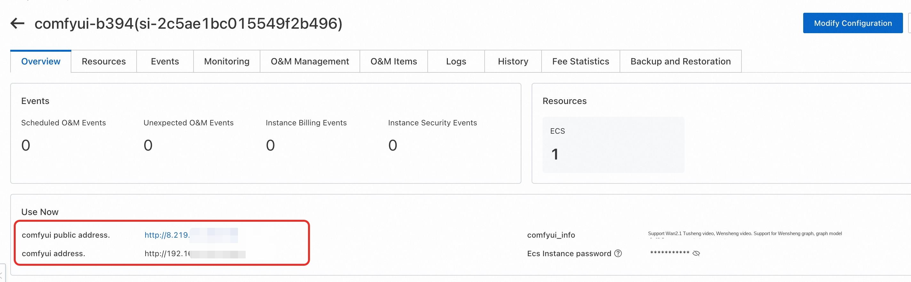
2. Access the "file list", under the path/llm-model/model for all types of models.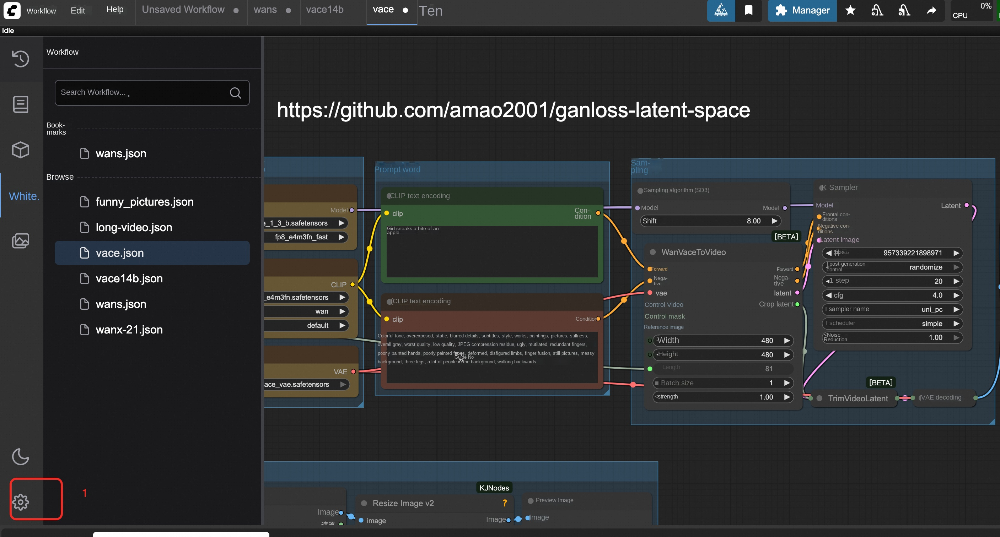
3. You can upload the model according to your own needs and restart the comfyui client.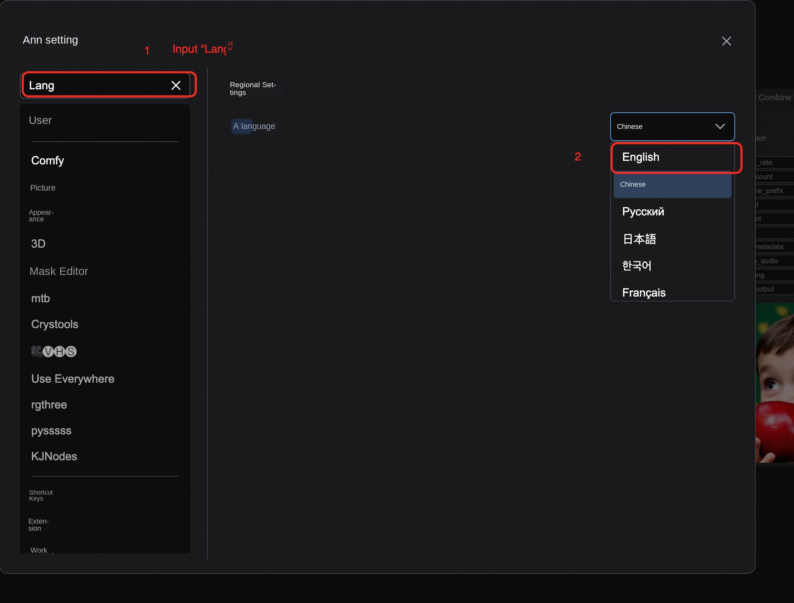

### Model Download

1. recommend to go to magic to download
2. The model storage path is:/root/storage/models

## Use process

This service already has two workflows built in that you can use directly. The plugins and models involved are also ready.

### Tusheng video or Wensheng video function

1. Select the desired function in the figure below. It is recommended to choose only one to use to avoid bursting memory.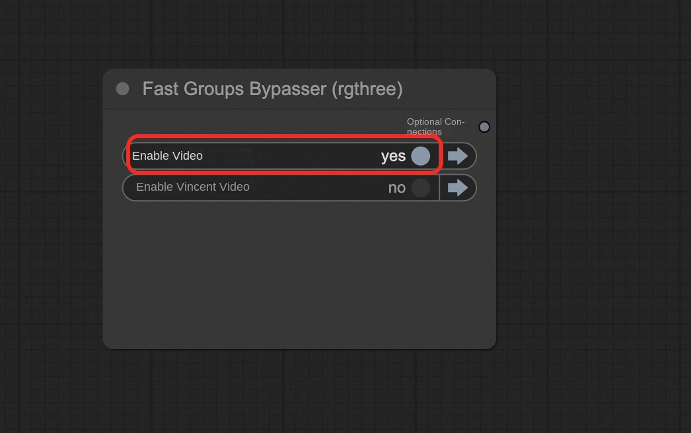
2. Select the workflow sidebar according to the instructions in the figure, select wanx-21.json and open it.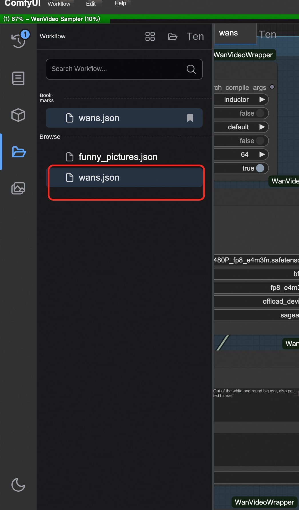
3. Select a sample picture here or choose your own local computer to upload.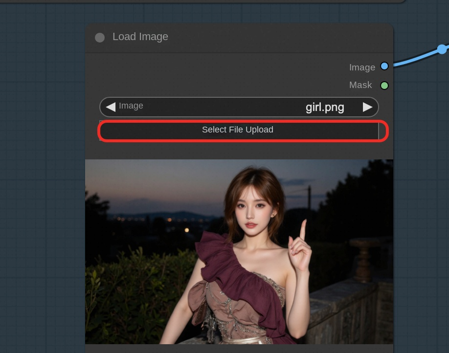
4. Fill in the description at the TextEncode. The upper part is what you want to generate, and the lower part is what you don't want to generate.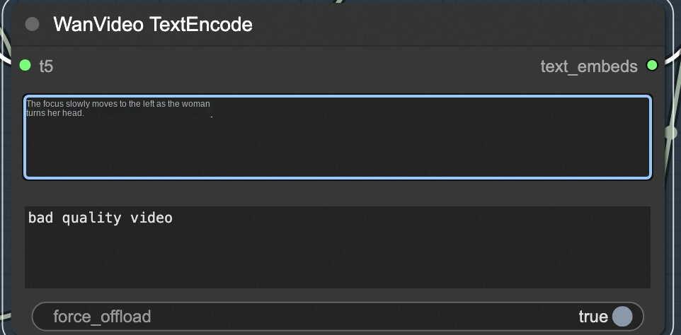
5. The resolution and frame number of the picture can be set at the ImageClip Encode. This model can be set up to 720*720.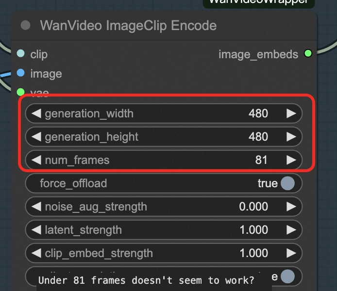
6. Other parameters can refer to official website: https://comfyui-wiki.com/zh/interface/node-options或以下文档:https://github.com/kijai/ComfyUI-WanVideoWrapper/blob/main/readme.md

PS: If you use the vace model, you can use the workflow vace.json as a reference
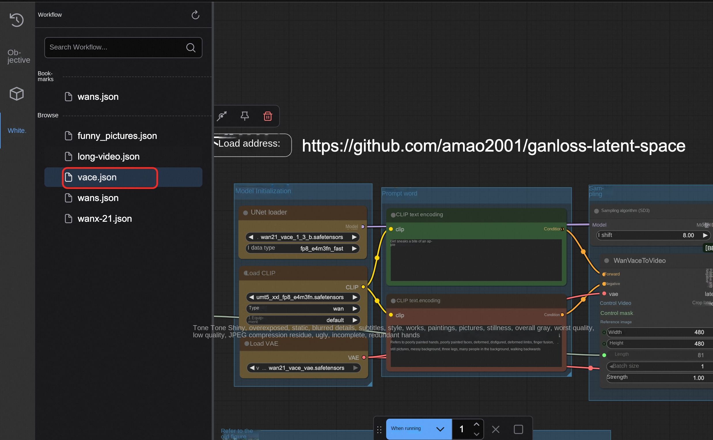

### Wensheng diagram function

1. Select the workflow funny_pictures.json in the workflow box.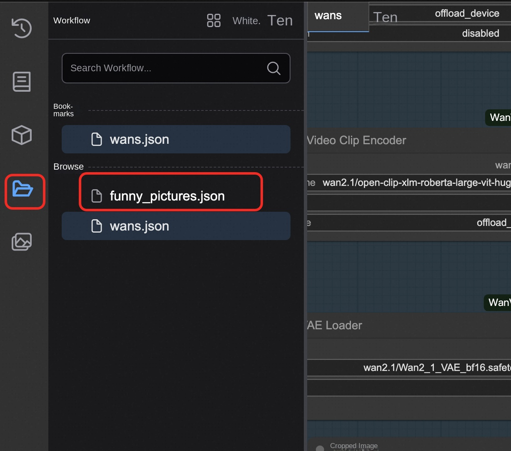
2. Enter what you want.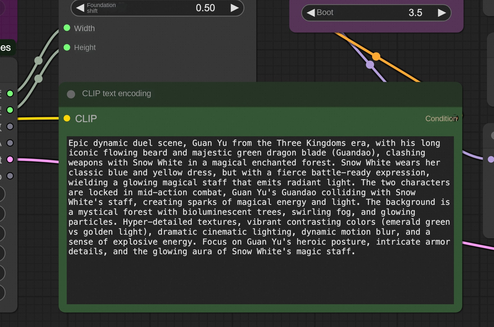
3. Here you can enter some funny content, for example, I am Guan Yu vs. Snow White.
4. The resolution of the picture and the number of pictures can be set here. If you want to speed up production, you can set the batch_size to 1.
5. Wait for the image to be generated.

### Figure function

Access the template, or import your own workflow.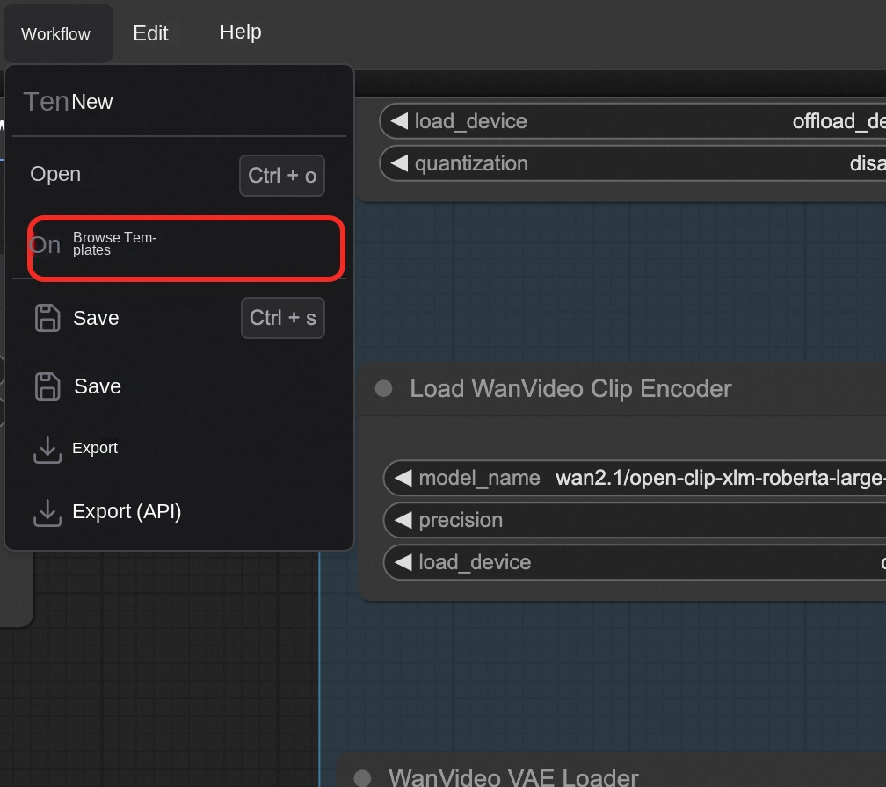

## API call

### API Endpoint Overview

| Endpoint | Method | Function | Description |
| ------ | ------ | ------ | ------ | ------ |
| '/queue' | GET | Get the queue status | View the current task queue |
| '/prompt' | POST | Submit Workflow | Execute Build Task |
| '/history/{prompt_id}' | GET | Obtain execution history | View task execution results |
| '/upload/image' | POST | Upload an image | Upload an input image file |
| '/view' | GET | Download the output file | Get the generated result file |

Supports public or private network API calls.
You can refer to the code to implement an API call script.

'''python
import requests
import json
import time

def run_workflow_file(workflow_file, server="http://127.0.0.1:8188"):
"" "Run Local Workflow JSON File" ""

# Load workflow
with open(workflow_file, 'r', encoding='utf-8') as f:
workflow = json.load(f)

# Submitted
response = requests.post(f"{server}/prompt", json={"prompt": workflow})
prompt_id = response.json()['prompt_id']
print(f "Task submission: {prompt_id}")

Waiting for completion
while True:
response = requests.get(f"{server}/history/{prompt_id}")
history = response.json()
if prompt_id in history:
break
print("Waiting...")
time.sleep(3)

# Download all output files
outputs = history[prompt_id]['outputs']
for node_id, node_output in outputs.items():
# Handle different types of output
for file_type in ['images', 'videos', 'gifs']:
if file_type in node_output:
for file_info in node_output[file_type]:
filename = file_info['filename']
file_url = f"{server}/view?filename={filename}&type=output"

response = requests.get(file_url)
with open(filename, 'wb') as f:
f.write(response.content)
print(f "Downloaded: {filename}")

# Use Examples
run_workflow_file("my_workflow.json")
'''

The local workflow is obtained by using the method provided in the following figure:
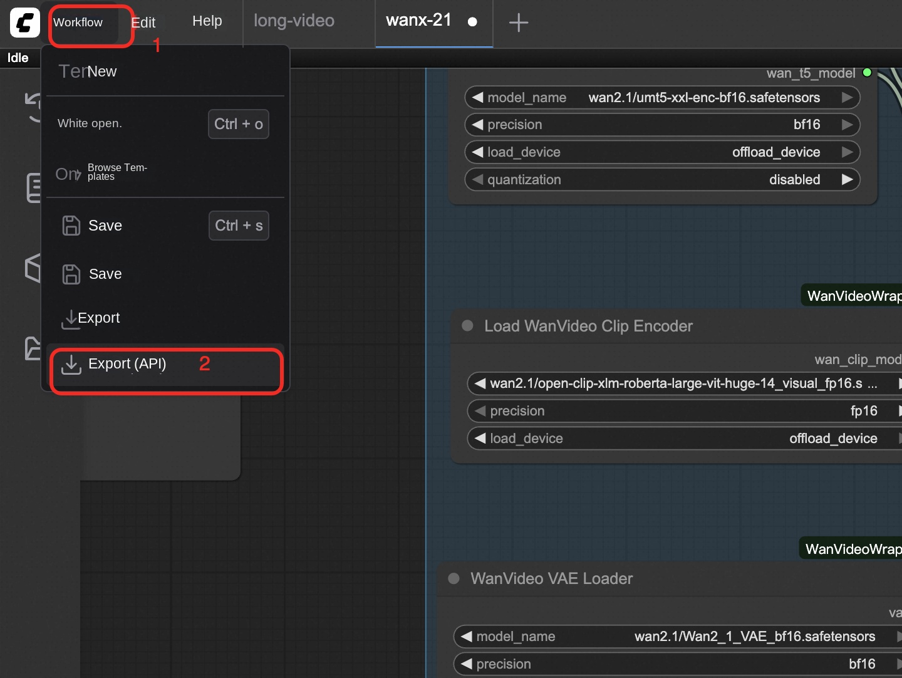

Since the Comfyui does not provide official API documents, here are two complete examples based on Wen Sheng video and Wen Sheng video: on how to use API to call workflow for Wen Sheng diagram or Wen Sheng video, etc.
Visit: https://github.com/aliyun-computenest/comfyui-acs/
Find the demo folder
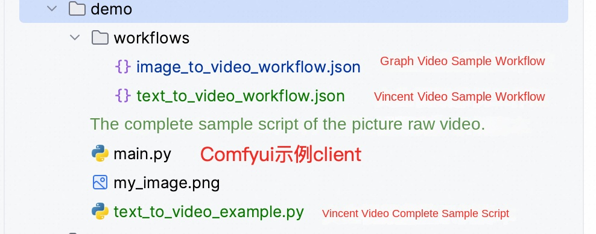

### Wen Sheng Video API Mode

1. Open the workflow defined for confirm the good model. (The default model defined inside is the 14B's Wanxiang 2.1 Wensheng video model)
2. Confirm parameters such as Prompt and generated resolution
3. Modify the server service address in the code from 127.0.0.1 to your actual service address.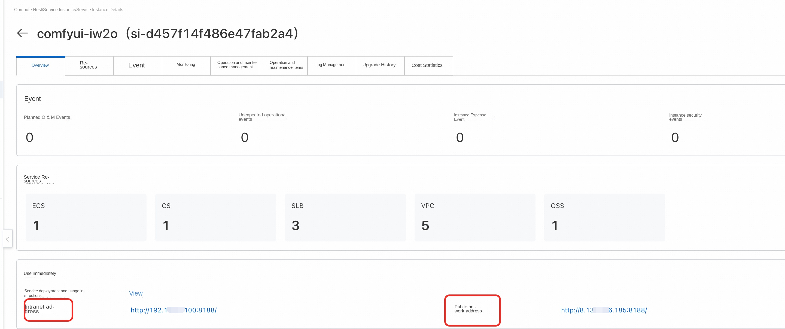
4. Local execution of python, waiting for video generation.

### Picture generation video API

1. Open the workflow defined for confirm the good model. (The default model defined inside is the video model of 14B universal phase 2.1 map generation)
2. Confirm parameters such as Prompt and generated resolution
3. Modify the server service address in the code from 127.0.0.1 to your actual service address.
4. Local execution of python, waiting for video generation.

## Account password

The default account and password are:
1. Account number: admin
2. Password: admin

## Frequently Asked Questions

1. If a node type does not exist, install the missing node through manager and restart.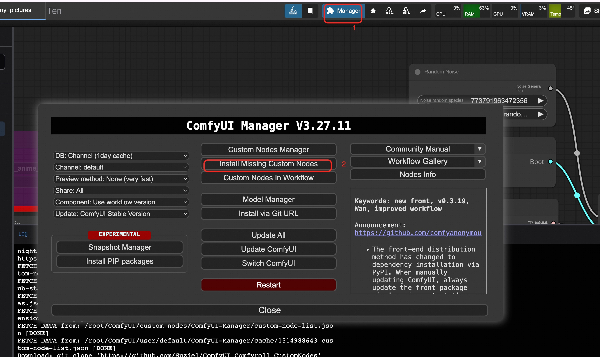